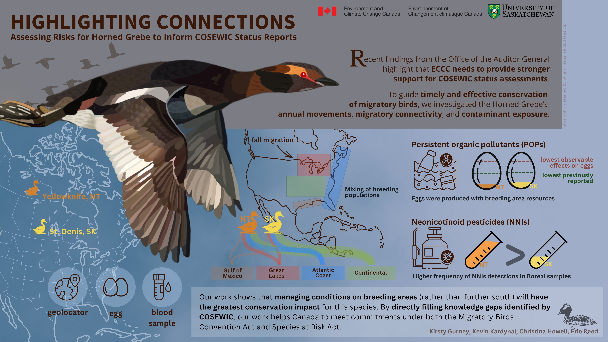
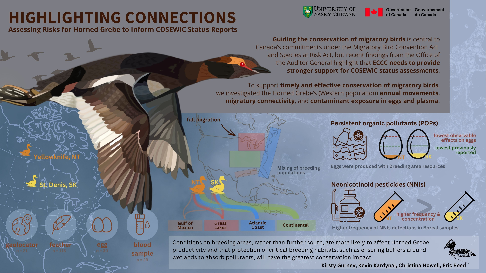
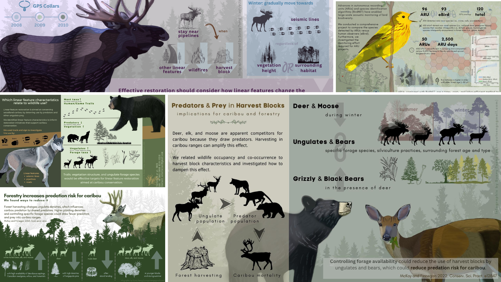

# Infographic design for a Horned Grebe study

## About
This is an infographic design contract from Kirsty Gurney (ECCC) for a presentation in the upcoming “Science to Policy” day meeting. 

- [Outline](./docs/outline.md)

## Request from client

We will include the infographic as slide in the presentation deck, so it can be projected in the room and displayed online simultaneously. Dimensions fitting the default ‘widescreen’ (16:9) format in PowerPoint are preferred. High-resolution imagery would be ideal, but the slides/infographics themselves will be presented as the standard powerpoint slide sizes.

## Product

#### version 2 (2025 Nov.9)

Download the file in [PDF](./product/horned_grebe_infographic_v2.pdf), [PNG](./product/horned_grebe_infographic_v2.png), or [JPG](./product/horned_grebe_infographic_v2.jpg)

#### version 1 (2025 Nov.8)

## Time line

| Item | Due | Communication with client |
| ----------- | ------------- | ------ |
| Draft of the text content | Oct.29 | agree on the text content |
| Graphic design            | Nov.4 |   |
| Text design               | Nov.7 |   |
| First product             | Nov.9 | review of the product     |
| Revision(s)*              | Nov.11  |   | 

*Sunny will provide 2 rounds of minor revisions for the final product. Minor revisions are usually within 1 hour of editing time for each round of revisions. After that it will be charged $35 per hour.

## Expected output

- Dimension: 1920x1080 pixel
- Orientation: Horizental
- Color: coloured
- File type: PNG, JPEG, PDF

## Expected compensation

A total cost ranging from $900 to $1000 CAD.

| Expected hours | Task |
| --- | --- |
| 6 | materials collection and text processing |
| 4 | communication (i.e., email, video call) |
| 10 | visual design |
| 4 | text design |
| 2 | review and final editing of the work |
| 2 | others |

## Tools

I will be using these platforms for designing: 

- [GIMP](https://www.gimp.org/): an image editor for most of the visual design, including digital drawing.

- [Krita](https://krita.org/en/): a professional open source painting program

- [Canva](https://www.canva.com/): a design tool for presentations and social media. I will be using canva for the text design. 

My design style. Visit my website to view more previous works: https://sunshineland.netlify.app/science/

## References

- [FUSE consulting company](https://www.fuseconsulting.ca/infographics)
- [FRI research](https://friresearch.ca/search/?frisearchable_posts%5BhierarchicalMenu%5D%5Btaxonomies_hierarchical.publication_type.lvl0%5D%5B0%5D=Summaries%20and%20Communications&frisearchable_posts%5BhierarchicalMenu%5D%5Btaxonomies_hierarchical.publication_type.lvl0%5D%5B1%5D=Infographics)

